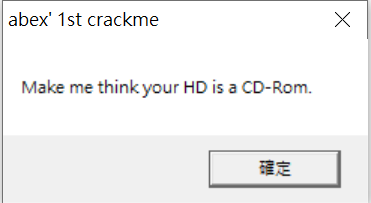
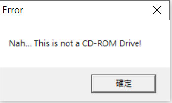
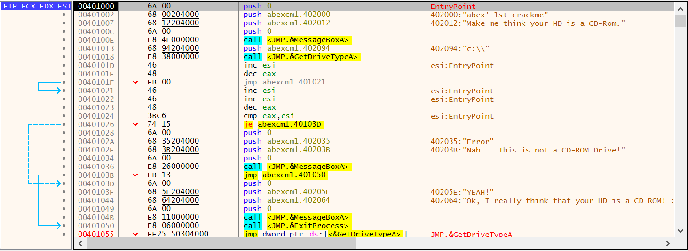

Abex's CrackMe #1
===

先執行看一下

丟到 x64dbg

其實很簡單，就是
1. 先用 MessageBox() 跳視窗
2. 用 GetDriveTypeA() 抓 C 槽的 Type

看下面敘述是要 type 為 CD

所以這邊直接改 `401026` 位址

把 JE 改成 JNE 即可

改好後，點選檔案 -> 修補程式檔 -> 修補檔案 -> 選取此 crackme 即可